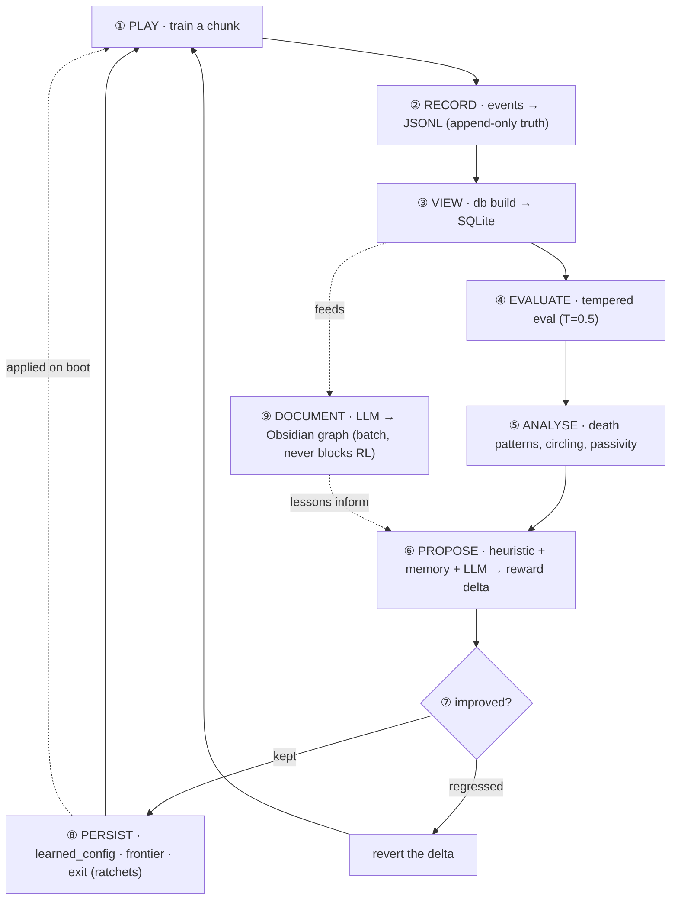

<div align="center">

# 🔥 HeLLMind

**He·LLM·ind** — *Hell* (Doom) + *LLM* + *Mind*

A Doom agent that **learns, remembers, and improves itself** — and writes the whole story
into an Obsidian knowledge graph. A local LLM documents and steers it, never blocking the
training loop. **100% local, no API key, no cost.**


</div>

---

## What it is, in one minute

You train a neural network to play Doom with reinforcement learning — **PPO** (on-policy) or
**QR-DQN** (off-policy with a replay buffer, the sample-efficient V2 engine). That part is
normal. What makes HeLLMind different is everything **around** it:

- The agent **senses** much more than raw pixels (its own health, a map of where it's been,
  3D depth, enemy detection…).
- It **remembers across runs** (deaths, frontiers, what worked) and **feeds that back** into
  its own training.
- It **forms hypotheses, runs A/B experiments, and keeps what's proven** — a self-improvement
  loop, not just a training script.
- A local **LLM documents** all of it into an Obsidian graph, in batch, so it never slows the
  RL loop.
- You can even **play yourself** and the agent learns from your demonstration.

Everything is on by default — clone it, run one command, and the full agent is working.

---

## 🧠 How the agent is built (the architecture)

Think of it as a creature with **senses → a brain → memory → a coach**.

```
                        ┌─────────────────────── THE AGENT ───────────────────────┐
   ViZDoom (Doom)  ───▶ │  SENSES (observation)          BRAIN (neural net)        │ ──▶ action
                        │  • pixels (what it sees)        • CNN reads the image     │
                        │  • spatial memory (where I've   • + a small net reads     │
                        │    been)                          health/ammo             │
                        │  • depth (3D distance)          • MultiInputPolicy         │
                        │  • automap (opt-in layout)      • PPO or QR-DQN engine     │
                        │  • health + ammo (its state)    └──────────────────────  │
                        │  • on-screen enemy detection                              │
                        └────────────────────────────┬─────────────────────────────┘
                                                     │  every episode
                                                     ▼
   ┌──────────────────────── MEMORY (persists across runs) ────────────────────────┐
   │  deaths + context · frontier cells · exit positions · lessons · learned config │
   └────────────────────────────────────┬──────────────────────────────────────────┘
                                         │  drives decisions
                                         ▼
   ┌──────────────────────── COACH (the self-improvement loop) ────────────────────┐
   │  behaviour flags → hypotheses → A/B experiments → adopt what's proven          │
   │  + reward auto-tuning + curriculum + LLM documentation (batch, never blocks)   │
   └───────────────────────────────────────────────────────────────────────────────┘
```

### 1. Senses — what the agent perceives

The agent learns from reward, not labels. By default it perceives **all** of these:

| Sense | What it gives the agent | Inspired by |
|-------|-------------------------|-------------|
| **Pixels** (84×84, stacked) | the raw view | every Doom RL agent |
| **Spatial memory** | a 2nd image channel showing where it has already been | exploration research |
| **Depth buffer** | per-pixel distance → 3D structure for navigation | UNREAL / Arnold |
| **Health + ammo** | normalised numbers fed into the net → it KNOWS when it's weak | **DFP / Arnold (the ViZDoom winners)** |
| **Enemy detection** | ground-truth "is an enemy on screen?" from the labels buffer | Arnold's aux signal |
| **Automap** *(opt-in)* | a top-down map of the explored layout — `AUTOMAP=1` (off by default for speed) | navigation agents |

### 2. Brain — the neural network

A **CNN** reads the stacked image, a **small network** reads the health/ammo vector, and they
combine (`MultiInputPolicy`). Two interchangeable RL engines train it:

- **PPO** (default, on-policy) — a **stochastic** policy: it outputs a *distribution* over actions.
  It **samples** while training (exploration) and in eval we use **tempered sampling
  (`--temperature 0.5`)**, NOT pure argmax — pure argmax can freeze into a bad action
  (“argmax-collapse”) when entropy is low.
- **QR-DQN** (`--algo dqn`, off-policy) — value-based, so action = **argmax over Q-values** by
  nature. Replay buffer + continuous updates make it more sample-efficient on discrete Doom.

**Action space:** 15 combined actions (move+turn+shoot+use+weapon), or **19 with `STRAFE=1`** —
the extra 4 are combat-survival moves (circle-strafe-while-firing, retreat-while-firing). The
policy picks one combined action per step.

**Perception channels (obs):** pixels + spatial-memory + depth (+ optional **semantic channel**,
`SEMANTIC_CHANNEL=1`, which paints the detections — enemy/door/item by category — INTO the input
so the net *sees* “what is where” instead of inferring from raw pixels; a 3-seed A/B showed
+31% exploration). Run `doom-cli intel` to see the exact architecture and parameter count.

**Why PPO is the default (and when to reach for QR-DQN).** The `auto` loop runs **PPO** by
default — not because QR-DQN is worse (it actually scored well: ~2 kills/ep, 0 deaths), but
because the whole pipeline is built around PPO:

| Reason PPO is default | Detail |
|---|---|
| **Imitation is PPO-only** | behavioral cloning (your demos / assist-as-teacher) clones into a PPO policy; QR-DQN is value-based and can't be bootstrapped from demos the same way |
| **Scenario curricula are PPO-only** | `my_way_home`, `defend_the_center` (isolated aim) — `train_dqn` only does campaign maps |
| **All recent work is PPO** | semantic channel, the 19-action brain, the staged curriculum |

**The honest case FOR QR-DQN:** it's an **off-policy** method with a replay buffer, so it
**reuses** each frame many times — often **more sample-efficient on discrete actions** (Doom is
discrete). That's exactly the lever for the laptop **compute wall** (no cloud). The smart
auto-tuner is already algo-aware (it un-freezes via `DQN_EPS_FINAL` instead of `ENT_COEF`). The
cost of switching: you lose the PPO brains + the BC bootstrap, and the DQN loop was historically
more fragile (≈10 bugs fixed). Try it with `doom-cli auto --algo dqn`.

### 3. Senses for exploration & combat (reward shaping)

V2 collapsed a ~12-term reward zoo down to **4 active buckets** (the rest were reward-hacking
surface). The active defaults:

| Signal | What it does |
|--------|--------------|
| **Combat** (kill / hit / miss / death) | the primary objective — kills and hits dominate, dying is expensive |
| **RND** (curiosity) | rewards visiting unfamiliar places — never saturates |
| **Frontier / coverage** | pays only *net outward* progress (spinning in circles can't farm it) |
| **Exit proximity** | once the exit is found once, a dense gradient guides the agent back |
| **Auto-USE (doors)** | holds USE every frame so **doors open / switches fire on contact** |
| **Combat/exploration split** | gates which objective the reward emphasises by enemy visibility |

**Opt-in (off by default, flip in `.env`):** Go-Explore frontier goals (`GOEXPLORE_GOAL_PROB`),
discovery reward, engagement reward, weapon-variety, bestiary-weighted kills. Each was demoted
in V2 because it added tuning surface without a proven win — re-enable individually if needed.

**Combat / exploration decoupling** (inspired by the ViZDoom champions like Arnold, who used
separate nav + combat networks). HeLLMind does a lighter version: **one brain**, but the
reward pursues **one objective at a time**, gated by ground-truth enemy visibility — enemy on
screen → combat focus (exploration pulls damped so it fights instead of wandering off); screen
clear → exploration focus (blind shots not punished). It also measures the two regimes
separately (`combat_engagement` = does it shoot when it sees enemies?), so the coach can tune
combat and exploration **independently**. *(Honest note: this is reward-level decoupling, not
yet two separate networks.)*

### 4. Memory — what persists across runs

Stored on disk (JSONL for safe writes, SQLite as the queryable view):

- **Death patterns** (health, region, which enemy) — used to target the agent's real weakness.
- **Frontier archive** (Go-Explore) — grows every run; the agent can be sent further over time.
- **Exit memory** — the first time it reaches an exit, the position is saved forever.
- **Learned config** — any reward change *proven* to help is kept permanently.
- **Lessons / bestiary** — LLM-extracted insights and a factual monster database.

### 5. Coach — the self-improvement loop

`doom-cli auto` trains a chunk, measures it honestly, and nudges one reward knob toward the
weakest metric — **keeping the change only if it helped, undoing it if it hurt.** It diagnoses
combat and exploration **separately** (low `combat_engagement` → un-freeze the policy; low
exploration → push the frontier levers) and every adjustment is written to a structured
**rollback log** (`doom-cli rollback`) so a regression can never stick. It resumes by default
and accumulates, so you can just leave it running. The full cycle is the
[knowledge loop](#-the-knowledge-loop) below.

### Learning from YOU (behavioral cloning)

You can play a few rounds yourself; the agent clones your play as a starting point, then RL
refines it. This is the strongest lever for the hardest problem (reaching the exit) — it
turns "explore a maze blindly" into "fine-tune something that already roughly works".

```bash
python scripts/record_demo.py --map MAP01 --episodes 3 --strafe --minutes 10  # you play
doom-cli bc --epochs 10                                                         # it learns from you
doom-cli auto --map MAP01 --iterations 8 --steps 100000                         # RL refines
```

> Note: recording needs a game window, so play on your own machine (not headless Colab).

---

## 🧩 Features & technologies — what's on

Legend: ✅ **active by default** · ⬜ **built, off by default** (flip a flag) · 🔬 **built, not yet wired into the loop**

| Area | Feature / tech | State | Flag / note |
|---|---|---|---|
| **RL engine** | PPO (stochastic, MultiInputPolicy) | ✅ | the default brain |
| | QR-DQN (off-policy, replay buffer) | ⬜ | `--algo dqn` |
| | Recurrent PPO (LSTM) | ⬜ | `USE_LSTM=1` |
| **Perception (obs)** | Pixels + frame-stack | ✅ | `FRAME_STACK=2` |
| | Spatial memory channel | ✅ | `SPATIAL_MEMORY=1` |
| | Depth buffer channel | ✅ | `DEPTH_PERCEPTION=1` |
| | Game-vars (health/ammo) | ✅ | `GAME_VARS=1` |
| | Labels (ground-truth detections) | ✅ | `USE_LABELS=1` |
| | **Semantic channel** (detections → obs) | ⬜ | `SEMANTIC_CHANNEL=1` — +31% explore (3-seed A/B) |
| | Automap channel | ⬜ | `AUTOMAP=1` (off: ~10% slower) |
| **Actions** | Strafe + combat-survival (19 actions) | ✅ | `STRAFE=1` (dodge/retreat while firing) |
| **Reward shaping** | Kill/hit/damage/death, engagement | ✅ | combat core |
| | Coverage + frontier (anti-circle) | ✅ | exploration |
| | RND intrinsic curiosity | ✅ | `USE_RND=1` |
| | Go-Explore frontier goals | ✅ | `GOEXPLORE_GOAL_PROB` |
| | Discovery / exit-proximity | ✅ | guides to objects/exit |
| | Combat⇄explore split | ✅ | `COMBAT_EXPLORE_SPLIT=1` |
| **Mechanical assists** | Auto-USE / auto-aim / best-weapon / door-nav (vision) | ✅ | crutches; turn OFF to train the net solo |
| **Door/exit from WAD** | door + exit positions parsed from the map | ✅ | minimap + exit_progress metric |
| **Imitation** | Behavioral cloning from human demos | ✅ | `doom-cli bc` |
| | Assist-as-teacher demos | ✅ | `scripts/record_assist_demos.py` |
| | Demo retrieval (`--recall`) | 🔬 | built; didn't beat baseline (distribution shift) |
| **Self-improvement** | Auto loop (train→eval→diagnose→tune→keep/revert) | ✅ | **the default mode** |
| | LangGraph coach | ⬜ | `auto --graph` |
| | Rich-metric diagnosis (spray/circling/reward-mix) | ✅ | auto reads aim/wasted/breakdown |
| | LLM tunes ANY param (full registry) | ✅ | `rl/tuning_registry.py` (needs Ollama) |
| | Lessons + memory-policy + rollback + learned-config | ✅ | the vault flow |
| | Semantic memory (vector DB) in the loop | ✅ | coach recalls similar past situations by meaning + records each outcome |
| **Curriculum** | Staged skill curriculum (combat→nav→objectives) | ⬜ | `scripts/skill_curriculum.py` |
| | Scenario curriculum (my_way_home→corridor→MAP01) | ⬜ | `doom-cli curriculum2` |
| **Observability** | Rich metrics (aim/move/weapons/perception panels) | ✅ | `doom-cli eval` |
| | HTML report (charts/formulas/recs) | ✅ | `eval --html` |
| | Prometheus + Grafana dashboards | ⬜ | `monitoring/` + `PROMETHEUS_GATEWAY=` |
| **Cognition / docs** | Obsidian notes, bestiary, knowledge graph | ✅ | `DOCS_ENABLED=1` (local Ollama) |

---

## 🧠 The knowledge loop (how it learns about its own learning)

HeLLMind is **two interlocking loops**. A **fast loop** tunes the agent (play → eval →
propose → keep/revert). A **slow loop** accumulates knowledge (events → lessons → an Obsidian
graph). The bridge is the *propose* step: it consults the accumulated memory, so the more the
slow loop turns, the smarter the fast loop's decisions get.

**What the `propose` step actually consults (the full vault flow):**

1. **Rich-metric diagnosis** — not just kills/explored, but `aim_offset` (is it centring enemies?),
   `wasted_shot_rate` (spraying?), `revisit_rate` (circling?), and the **reward breakdown** (is the
   reward 82% exploration when the goal is combat?). It picks the knob that targets the weakest one.
2. **Lessons** — events → `aggregate_events` → an LLM distils reusable lessons across runs.
3. **Memory-policy** — death patterns → knob suggestions that AVOID changes a past run disproved.
4. **Semantic memory** — *"have I seen a situation like this before, and what worked?"* It matches
   past iterations by MEANING (not keywords) and fills in proven settings; it records every
   outcome (wins **and** regressions) so it never re-recommends what failed.
5. **LLM proposer (full registry)** — given the catalog of **every** tunable parameter (name,
   range, effect) + the metrics, the LLM may change ANY knob, validated/clamped against the registry.
6. **Tradeoff / keep-revert** — the new config is kept only if the composite score holds; a
   regression is rolled back and remembered. The loop can only improve or hold.

So each turn the agent looks at **far more** than before, draws on the **whole** vault (lessons +
memory-policy + semantic + learned-config), and self-corrects — bounded only by training frames.



**Three rules keep it honest:**
1. **JSONL writes, SQLite only reads** — documentation never corrupts the source of truth.
2. **The LLM is decoupled & batch** — if the local model is down, RL keeps training.
3. **Knowledge is adopted only if PROVEN** — a lesson or knob enters `learned_config` only if
   it survives tempered eval. This gate is what stops the agent from "learning" noise (you can
   watch rejected iterations in `doom-cli timeline`).

Knowledge lives in four layers: **JSONL** (raw truth) → **SQLite** (queryable view) →
**Obsidian** (human-readable graph) → **learned_config + stores** (machine-applied). Full
diagram in [`vault/00-index/Knowledge Loop.md`](vault/00-index/Knowledge%20Loop.md).

---

## 🚀 Quick start (local)

```bash
git clone https://github.com/MatheuslFavaretto/HeLLMind.git && cd HeLLMind
python3.12 -m venv .venv && source .venv/bin/activate
pip install -r requirements.txt

doom-cli auto --map MAP01 --iterations 8 --steps 100000   # train + self-improve
doom-cli intel                                            # see the neural network + stats
doom-cli eval --temperature 0.5                           # measure how it actually plays
```

Everything is enabled by default in `.env`. The brain lives in the vault and is **reused**
automatically — run `auto` again and it continues. Use `--clear` to start over.

## ☁️ Run on Google Colab (free GPU)

The honest gap vs the ViZDoom champions is **compute** — they trained on GPU clusters for
days. A free Colab GPU + Google Drive + the resume loop lets you accumulate far more training
without tying up your machine. Full step-by-step in **[`COLAB.md`](COLAB.md)**.

---

## 🎮 Commands

```bash
# Run  —  `auto` is the DEFAULT/recommended training mode (it self-tunes). `train`/`dqn` are
#         one-shot escape hatches with no self-improvement.
doom-cli auto              # ⭐ DEFAULT: the main loop — train → eval → self-tune → repeat (resumes)
doom-cli auto --algo dqn   # …same loop, QR-DQN engine (off-policy, replay buffer — V2)
doom-cli auto --graph      # …with the LangGraph coach (observe→diagnose→hypothesize→propose)
doom-cli dqn               # one-shot QR-DQN training (no self-tuning)
doom-cli train             # one-shot PPO training (no self-tuning)
doom-cli curriculum2       # progressive curriculum: my_way_home → deadly_corridor → MAP01
doom-cli bc                # behavioral cloning from your recorded demos
doom-cli watch --overlay   # watch the agent play, with HUD + minimap overlay

# Measure
doom-cli eval --temperature 0.5   # honest metrics (kills, exploration, exit-rate)
doom-cli benchmark                # ablation: prove each layer (RND/memory/full) adds value
doom-cli intel                    # neural-net proof + training + memory + disk
doom-cli timeline                 # evolution per auto iteration (explored/exit/kills/score)
doom-cli audit                    # is it REALLY learning? (entropy, KL, value loss)
doom-cli progress                 # learning curve across checkpoints
doom-cli status                   # brain + memory + config at a glance

# Cognition / memory
doom-cli diagnose     # eval + behavior flags + next-step suggestion
doom-cli behavior     # detect circling / passive / low-exploration / shoot-spam
doom-cli hypothesize  # turn behaviour into falsifiable hypotheses
doom-cli experiment   # run a multi-seed A/B to validate a hypothesis
doom-cli knowledge    # long-term knowledge in 3 tiers: facts / hypotheses / validated
doom-cli rollback     # structured audit trail — every adjustment + keep/revert verdict
doom-cli learned      # reward knobs the agent has PROVEN help
doom-cli db query --runs   # per-iteration metrics straight from the SQLite view
doom-cli recall       # query episodic memory (by keyword / enemy / region)
doom-cli semantic     # vector-DB recall — find past situations by MEANING, not keywords
doom-cli bestiary     # factual monster database
doom-cli curriculum   # map difficulty + forgetting alerts
```

Toggle anything in `.env`. `DEPTH_PERCEPTION` is on by default; `AUTOMAP` is **off** (it costs
~10% throughput and `SPATIAL_MEMORY` already covers map coverage). Turning the heavy perception
channels off gives **~1.5× faster training** if you're compute-limited (ViZDoom is
CPU-render-bound, so fewer channels = more frames/hour). `N_ENVS=8` uses 8 of the M-series' 10
cores by default.

`SEMANTIC_CHANNEL=1` (off by default) feeds the DETECTIONS into the network as an extra obs
channel — each on-screen object painted by category (enemy/weapon/health/…) plus doors projected
from the WAD — so the policy SEES "what is where" instead of inferring from raw pixels. In a
**3-seed** controlled fresh-1M A/B on MAP01 (only this flag differs) it gives a **modest but
consistent** gain: exploration **0.227 vs 0.173** (+31%, gap > seed-to-seed std) and shooting
accuracy **0.131 vs 0.090**. (A single seed first showed a 2× exit-progress jump — that didn't
replicate across 3 seeds; multi-seed corrected the claim.) Changes the obs shape → needs `--fresh` (brain tag
`_se`). Watch what the net sees with `eval --overlay` (the "SEES" panel).

---

## 📊 Where it stands (honest)

This is a research/learning project, and it says so plainly. Measured on deterministic eval
across the V2 curriculum (full table: [`reports/CURRICULUM_RESULTS.md`](reports/CURRICULUM_RESULTS.md)):

- ✅ **First map completed** — on ViZDoom's `my_way_home` (exit-finding scenario), a PPO agent
  reaches the exit in **93% of episodes** at 901k steps (0% deaths, ~103-step solutions). The
  project's first **exit-rate > 0** — the roadmap's headline milestone.
- ✅ **More compute works** — same agent, 401k → 901k steps: exit-rate **50% → 93%**. Validates
  the V2 thesis: *it's compute, not features.*
- ✅ **Combat works** — `deadly_corridor`: **81% shooting accuracy**, advances and kills
  (QR-DQN on MAP01: 2 kills/ep, 0% deaths, 0.97 combat-engagement).
- ✅ **The machinery works** — every feature above is wired, tested (435 tests), and the
  self-improvement loop tunes the agent and accumulates memory across runs.
- 🧱 **The wall is the full map + compute** — on real freedoom2 MAP01, 1M steps explores only
  **4%** (the toy scenarios are far smaller). The skills are proven *in isolation*; combining
  them on a large, enemy-harassed level needs the tens-of-millions-of-steps budget the ViZDoom
  champions had — hence **Colab** ([`COLAB.md`](COLAB.md)). Not a missing feature; a compute gap.

> The project's own rule: *don't pile cognitive machinery on a weak agent — every feature
> must be shown to help on honest (deterministic/tempered) eval, not just produce a note.*

---

## 🗂️ Code layout

```
doom/            ViZDoom env (campaign.py), entities, RND, overlay, env adapter
rl/              train (PPO) · train_dqn (QR-DQN) · eval · autonomous (the loop) · coach_graph
                 bc · audit · introspect · algo · curriculum · progressive_curriculum · experiment
writer/          LLM client · documenter · learned_config · memory_policy · semantic_memory (vector DB)
                 memory/coverage/exit/frontier stores · db (SQLite) · behavior · hypothesize
instrumentation/ metrics · tracker · game variables
scripts/         record_demo (you play) · make_gif · probe_map
doom_cli.py      one unified CLI · config.py all settings (.env → dataclass)
```

## 🧪 Tests

```bash
doom-cli tests        # 435 tests — no ViZDoom / Ollama needed (synthetic data)
```

## 📜 License

MIT
