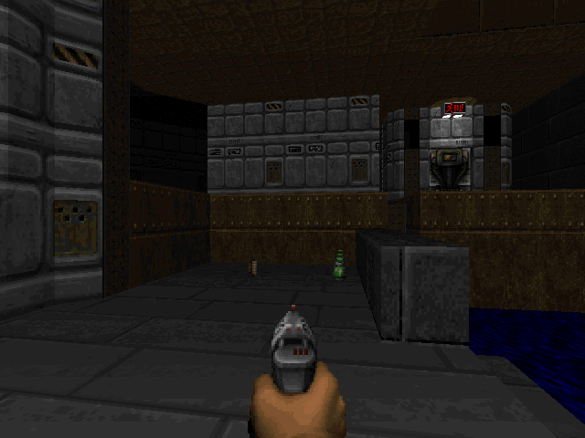
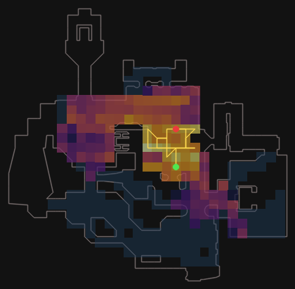
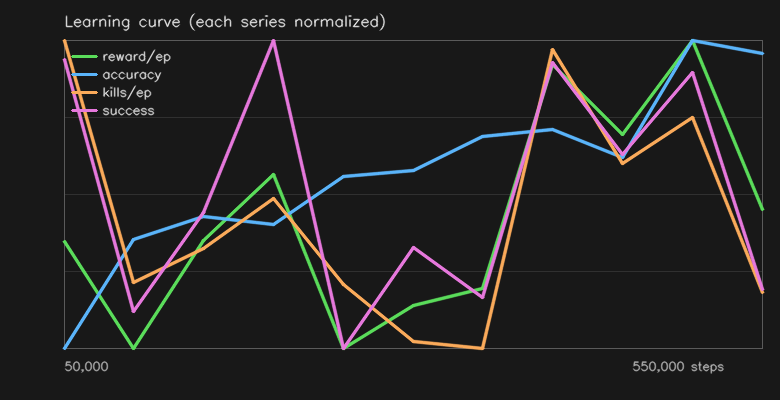
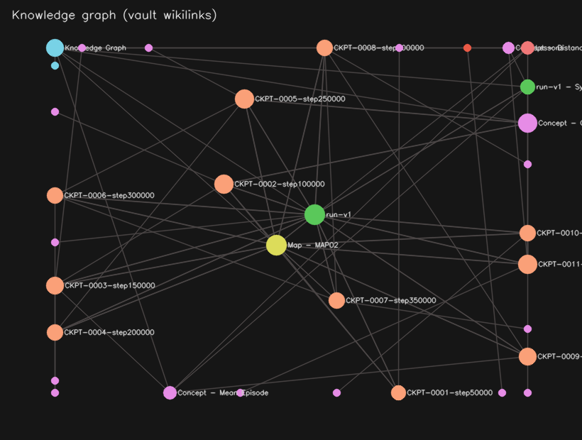
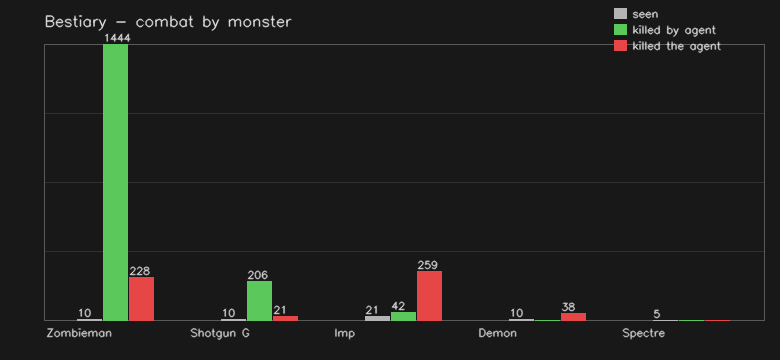
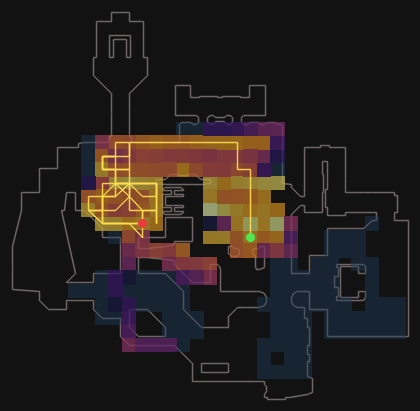

<div align="center">

# 🔥 HeLLMind

**He·LLM·ind** — *Hell* (Doom) + *LLM* + *Mind*

Training a PPO agent produces an ocean of opaque numbers. **HeLLMind turns every
training run into a navigable knowledge graph** — and closes a self-improvement loop
that generates falsifiable hypotheses, runs A/B tests, and **reverts regressions
automatically**.

A **Reinforcement Learning** agent plays Doom while a **local LLM** documents, reflects
on, and improves its own learning. **100% local, no API key, no cost.**


</div>

**What sets it apart from other RL+LLM projects:** the LLM stays *out* of the critical
training loop (batch only, post-training, ±2% FPS budget), so it never throttles PPO
throughput. The cognitive loop is measurable end-to-end —
`behavior flags → falsifiable hypotheses → multi-seed A/B (5% threshold) → curriculum
reweight`, with the verdict stored and regressions reverted automatically.

<div align="center">

### 🎮 The agent playing (deterministic policy, MAP02)


> Real freedoom2 gameplay captured headless — moves, aims, fights (≈4 kills/episode).

</div>

| 🎮 In-game | 🗺️ Minimap + path | 📈 Learning curve |
|:---:|:---:|:---:|
|  |  |  |
| **🕸️ Obsidian graph** | **👹 Bestiary** | **🔥 Coverage map** |
|  |  |  |

---

## 📈 Measured result (real, not a demo)

The self-improvement loop's job is to diagnose a failure mode and fix it without a
human. A concrete before/after from two unattended auto sessions on MAP01:

| Metric | Test B (reward-shaping only) | Test C (+ spatial memory + RND) | What it means |
|--------|:---:|:---:|:---:|
| **Timeout rate** | **90%** | **15%** | ⬅️ the agent stopped freezing at spawn |
| Death rate | 10% | 85% | now actively engages (and dies) instead of camping |
| Kills/episode | 1.90 | 1.15 | still fights |
| Map explored | 2% | 3% | exploration is the next frontier (brain still young, 206k steps) |

> **Honest status:** the loop *measurably eliminated passivity* (timeout 90%→15%) on its
> own — the agent went from standing still to engaging. Reaching the exit (`exit_rate > 0`)
> is **not yet solved** and is the current open milestone. Full write-up:
> [`results/test-c-2026-06-03.md`](results/test-c-2026-06-03.md).

---

## 🏗️ Architecture

```
  ┌──────────────────────────────── COGNITIVE LOOP ───────────────────────────────┐
  │                                                                                │
  │  Behavior flags ──► Hypotheses ──► A/B Experiments ──► Curriculum reweight    │
  │  (shoot_spam,         (falsifiable,   (multi-seed,        (more time on maps   │
  │   circling,            with config     5% threshold,       the agent fails on, │
  │   low_explore...)      delta)          verdict stored)     forgetting alerts)   │
  └───────────────────────────────────────────────────────────────────────────────┘
                                     ▲                │
                                     │ events         │ training config
                                     │                ▼
  edit control.md ─────────────┐
                                ▼
 ┌──────────────────────────────────────────────────────────────────────────────┐
 │ 1. TRAINING  (real-time, never blocks — ±2% FPS budget for all callbacks)   │
 │                                                                              │
 │    ViZDoom (headless) → PPO CnnPolicy (N parallel envs)                     │
 │                                                                              │
 │    Observation: ┌─────────────┬─────────────┐                               │
 │                 │  pixels     │  visited    │  ← spatial memory (opt-in)    │
 │                 │  84×84 gray │  grid 84×84 │    channel 2: where I've been │
 │                 └─────────────┴─────────────┘                               │
 │                                                                              │
 │    Reward shaping:  +hit  +kill  -miss  -damage  -death  -living             │
 │                     +coverage(new cells)  +frontier(outward progress)        │
 │                     +RND(intrinsic curiosity)  +exit_prox(after 1st exit)    │
 │                                                                              │
 │    Callbacks: Checkpoint · DocSnapshot · MemoryRecorder · Coverage          │
 └────────────────────────────────┬─────────────────────────────────────────┘
                                   │  end of training
                                   ▼
 ┌──────────────────────────────────────────────────────────────────────────────┐
 │ 2. POST-PROCESSING  (batch — only place the LLM runs)                        │
 │    process_run: checkpoint notes · concepts · minimap · synthesis            │
 │                 regression detection · lessons · reward suggestions           │
 └────────────────────────────────┬─────────────────────────────────────────┘
                                   ▼
 ┌──────────────────────────────────────────────────────────────────────────────┐
 │ 3. OBSIDIAN VAULT  (knowledge graph + persistent memory)                     │
 │    00-index/  · 10-checkpoints/ · 20-concepts/ · 30-runs/                    │
 │    40-maps/  · 60-lessons/ · 70-hypotheses/ · 80-recommendations/            │
 └──────────────────────────────────────────────────────────────────────────────┘
```

---

## 🤖 How the agent perceives the world

The agent has **no semantic labels** — it learns entirely from reward signals.

```
What the agent sees each step:
┌────────────────────────────────────────────────────────────┐
│  Channel 0: raw pixels (84×84 grayscale, 4 stacked)        │
│  ┌──────────────────────────────┐                          │
│  │  🟫🟫🟫🟫🟫🟫🟫🟫🟫🟫🟫  │  ← CNN learns: brown      │
│  │  🟫🔴🔴🔴🟫🟫🟫🟫🟫🟫🟫  │    pixel cluster =        │
│  │  🟫🔴👾🔴🟫🟫🟫🟫🟫🟫🟫  │    "shootable thing"      │
│  └──────────────────────────────┘                          │
│                                                            │
│  Channel 1 (spatial memory ON): visited cells map          │
│  ┌──────────────────────────────┐                          │
│  │  ⬛⬛⬛⬛⬛⬛⬛⬛⬛⬛⬛  │  ← black = never been    │
│  │  ⬛⬜⬜⬜⬜⬛⬛⬛⬛⬛⬛  │    white = already went   │
│  │  ⬛⬛⬛⬛⬜⬛⬛⬛⬛⬛⬛  │  → CNN learns: "go dark"  │
│  └──────────────────────────────┘                          │
│                                                            │
│  Game variables (numeric every step):                      │
│  HEALTH=87 AMMO=25 KILLS=2 HIT=5 DAMAGE=12 POS=(x,y,z)    │
└────────────────────────────────────────────────────────────┘
```

**What the agent does NOT know explicitly:**

| Question | Reality |
|----------|---------|
| Where is the exit? | Discovered by accident (EXIT_REWARD=1000). After 1st exit, proximity shaping activates. |
| What is that monster? | Inferred from HITCOUNT delta when it shoots it |
| Where are the doors? | Discovered via USE button trial/error near walls |
| Which path leads out? | Learned via spatial memory channel (dark = unexplored = go there) |

---

## 🚀 Getting started

```bash
python3.12 -m venv .venv && source .venv/bin/activate
pip install -r requirements.txt
cp .env.example .env          # set VAULT_PATH (default: ./vault)

# optional — for narrated notes
brew install ollama && ollama serve && ollama pull qwen2.5:7b

doom-cli auto --map MAP01 --iterations 5 --steps 100000
#   ↑ the recommended default: trains, evals, self-adjusts rewards, writes Obsidian report
```

---

## 🎮 doom-cli — full command reference

### Training (primary workflow)

```bash
doom-cli auto --map MAP01 --iterations 5 --steps 100000
#  Self-adjusting loop: train → eval → adjust reward → repeat → Obsidian report
#  The recommended way to train. Reverts regressions automatically.

doom-cli auto --map MAP01 --iterations 5 --steps 100000 --spatial --rnd --fresh
#  Teste C config: spatial memory (2nd obs channel) + RND intrinsic curiosity
#  --fresh required when --spatial is new (obs shape change: 84×84×1 → 84×84×2)

doom-cli auto --iterations 6 --steps 100000 --llm
#  With LLM-refined reward proposals (needs Ollama running)

doom-cli train --map MAP01 --steps 400000 --fresh
#  Manual one-shot training (no self-adjustment). Use for controlled experiments.

doom-cli train --map MAP01 --steps 400000 --fresh --spatial --rnd
#  Train with exploration upgrades
```

### Evaluation & debugging

```bash
doom-cli eval --episodes 20        # deterministic argmax eval (the honest number)
doom-cli diagnose                   # eval + behavior flags + next-step suggestion
doom-cli audit                      # RL quality audit: EV, entropy, KL, value loss
doom-cli audit --plot               # same but with matplotlib charts
doom-cli progress --points 5        # learning curve across checkpoints
doom-cli watch --episodes 3         # watch the agent play live
```

### Cognition & memory

```bash
doom-cli behavior                   # detect: shoot_spam / circling / low_explore / passive
doom-cli hypothesize                # generate falsifiable hypotheses from behavior flags
doom-cli experiment --hypothesis 1  # run A/B test for a hypothesis
doom-cli recall MAP01               # keyword search over episodic memory
doom-cli recall --enemy DoomImp     # all episodes where this enemy was nearby
doom-cli recall --region 1x2        # episodes ending in a specific map region
doom-cli db build                   # rebuild SQLite cognitive memory from JSONL
doom-cli curriculum                 # show map difficulty + forgetting alerts
doom-cli research --iterations 3    # full cognitive loop (behavior→hyp→exp→curriculum→train)
```

### Documentation & knowledge graph

```bash
doom-cli notes                      # write Obsidian notes from last training
doom-cli lessons                    # show cross-run lessons the LLM extracted
doom-cli bestiary                   # show factual monster database (from telemetry)
doom-cli log                        # show the autonomy log (auto session history)
doom-cli status                     # brain info, config summary, vault state
doom-cli perception                 # write "how agent sees the world" concept note
doom-cli behavior                   # write behavior flags to 80-recommendations/
```

### Utilities

```bash
doom-cli config                     # show current config (all env vars)
doom-cli gif                        # generate animated GIF from last run
doom-cli tb                         # open TensorBoard
doom-cli tests                      # run pytest suite (209 tests)
doom-cli maps MAP01 MAP02           # validate WAD maps (spawn, enemies, layout)
doom-cli clean --brain              # delete brain (keep vault)
doom-cli clean --memory             # delete episodic memory
```

---

## 📊 RL quality audit

Not every rising training curve means genuine learning. `doom-cli audit` runs 5 independent checks:

```
=== RL Quality Audit — PPO_9 ===

  value_quality          [█████████░] 9/10
    EV=0.905 — value function excellent
  entropy_health         [████░░░░░░] 4/10
    entropy rising (-1.37) — policy still exploring (expected for fresh brain)
  kl_stability           [█████████░] 9/10
    KL=0.0061 — stable updates
  value_improving        [█████████░] 9/10
    val_loss=9.44, trending down — value function improving
  reward_learning        [█████████░] 9/10
    ep_rew=82.7, rising — genuine learning

  OVERALL: 8.0/10
  ✅ Agent is genuinely learning — trust these eval numbers.
```

---

## 🧠 Self-improvement loop (`doom-cli auto`)

```
Iteration 0 (baseline)
  ├── train 100k steps
  ├── eval 10 episodes (deterministic argmax)
  └── score = 4×exit_rate + 3×explored + 1×accuracy + 0.5×min(kills,5)/5
              (every term normalised to [0,1] so the WEIGHTS set the priority —
               kills capped so a spawn-camper can't outscore a real explorer)

Iteration 1
  ├── propose_next: timeout_rate=90% & explored<15%
  │   → episode too short: raise EPISODE_TIMEOUT 2100→3150   (self-diagnosed)
  ├── propose_next: explored_fraction=2% < 10%
  │   → raise COVERAGE_REWARD 1.5→2.1, FRONTIER_REWARD 0.05→0.075
  ├── train 100k steps (continued from iter 0 brain)
  ├── eval → score improved? KEEP : REVERT (auto-rollback)
  └── write to Autonomy Log.md   (a crashed iteration is caught, not fatal)

...

Iteration N (final)
  ├── write Auto Session — MAP01 — 2026-06-03.md
  │   ├── before/after table
  │   ├── all adjustments tried (kept / reverted)
  │   ├── behavior flags detected
  │   └── best config to copy
  └── update vault graph
```

---

## 🗂️ Vault structure

```
vault/
├── 00-index/         Knowledge Graph.md · Autonomy Log.md · control.md
├── 10-checkpoints/   CKPT-NNN-stepXXX.md  (checkpoint notes + minimap)
├── 20-concepts/      Concept - Policy Entropy.md · Agent Perception.md
├── 30-runs/          run-main.md · Auto Session — MAP01 — 2026-06-03.md
├── 40-maps/          Map - MAP01.md · Curriculum.md
├── 60-lessons/       Lessons.md             (cross-run knowledge)
├── 70-hypotheses/    Hypotheses.md · Experiment-H1.md
├── 80-recommendations/ Behavior.md          (flags + fixes)
├── .checkpoints/     ppo_campaign_a11_final.zip  (the brain)
└── .memory/          episodic/events.jsonl · lessons/lessons.jsonl
```

---

## 📁 Code layout

```
doom/             ViZDoom env: campaign.py · env.py · rnd.py · entities.py
rl/               PPO: train.py · eval.py · autonomous.py · audit.py
                  callbacks.py · curriculum.py · experiment.py · research_agent.py
writer/           LLM + notes: process_run.py · reflect.py · behavior.py
                  hypothesize.py · db.py · recall.py · memory_store.py
instrumentation/  metrics · tracker · game_vars
doom_cli.py       unified CLI (all commands above)
config.py         all settings (env vars → dataclass)
```

---

## 🔬 Design notes & open questions

Honest engineering trade-offs, not swept under the rug:

- **Spatial memory mixes two coordinate frames.** Channel 0 (pixels) is *egocentric*
  (first-person view); channel 1 (the visited grid) is *allocentric* (top-down world
  coordinates projected through the map bbox). The CNN must reconcile both in one tensor.
  It's plausible — humans read a minimap fine — but **not yet ablated**: Test C ran them
  together, so we can't yet separate "spatial memory helped" from "RND alone did it."
  The clean next experiment is RND-only vs RND+spatial on the same seeds
  (`doom-cli experiment` is built for exactly this).

- **`EXIT_REWARD=1000` is a large sparse terminal reward** — only ever seen if the agent
  stumbles onto the exit, so it's **high-variance across seeds** and can fail to converge
  on harder maps. Mitigation: once the exit is reached once, its position is memorised and
  `exit_prox_scale` shapes a *dense* gradient toward it on later episodes
  (`campaign.py`). Until that first success, the signal is ~zero — which is precisely why
  exit-rate is still the open milestone.

- **The composite score weights (`4/3/1/0.5`) are deliberate, not arbitrary.** Priority is
  *finish > cover > aim > fight*, and **every term is normalised to [0,1] first** so the
  weights alone set the ordering. This fixes a real earlier bug: `kills/ep` is unbounded,
  so `0.5×kills` once let a spawn-camping brain (4 kills, 3% explored) outscore a real
  explorer (40% explored) — the exact local optimum the agent kept collapsing into.
  Capping kills at 5 restores the intended priority (see `score()` in `rl/autonomous.py`).

## 🧪 Tests

```bash
doom-cli tests          # 209 tests — no ViZDoom / Ollama needed (synthetic data)
pytest tests/ -q        # direct (same thing)
```

Tests cover: PPO pipeline · memory store · SQLite cognitive memory · behavior detection ·
hypothesis generation · experiment engine · curriculum · RND · env adapter · recall API.

## 📜 License

MIT
