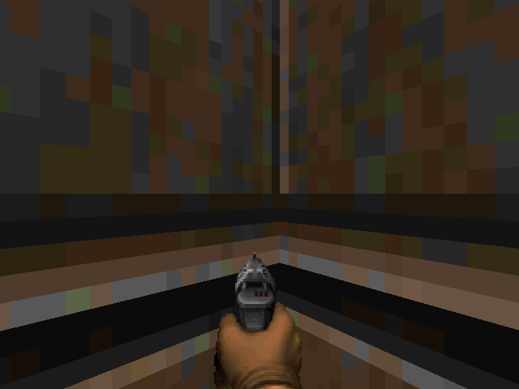
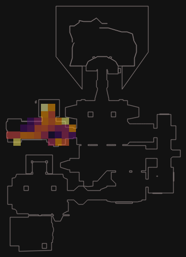
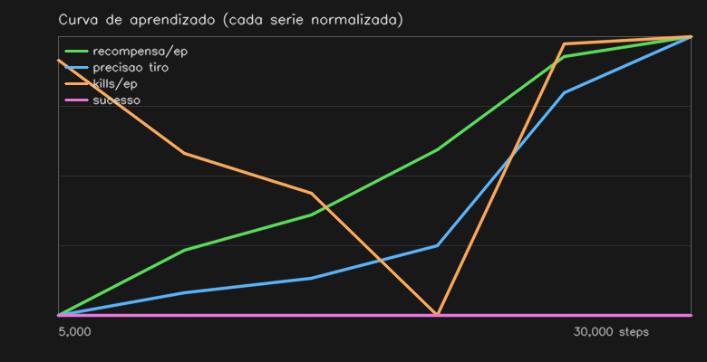
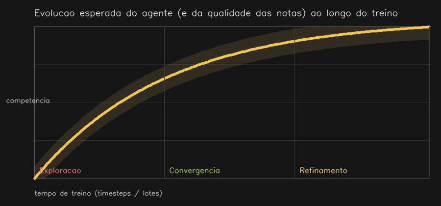

<div align="center">

# 🔥 HeLLMind

**He·LLM·ind** — *Hell* (Doom) + *LLM* + *Mind*

Um agente de **Reinforcement Learning** joga Doom enquanto um **LLM local** documenta
o próprio aprendizado num **grafo de conhecimento no Obsidian**. 100% local, sem custo.


</div>

| 🎮 Agente jogando | 🗺️ Mapa real + caminho | 📈 Performance (5%→18% precisão) |
|:---:|:---:|:---:|
|  |  |  |

> O treino e o LLM são **desacoplados**: o Ollama nunca roda dentro do loop do PPO
> (isso travava o treino) — as notas saem em lote, no fim. Funciona até **sem Ollama**
> (notas em modo factual) e treina **em lotes** (`--resume`).

---

## ⚙️ Como funciona

```
ViZDoom → PPO (CnnPolicy, N envs)  ─ reward: +acerto −erro −dano −morte
   │  callback rápido grava snapshots novos (sem LLM → não trava)
   ▼  .cache/pending_runs/<run>.jsonl
        ── fim do treino ──
writer.process_run → LLM (Ollama) lê em lote e escreve no vault:
   notas de checkpoint · conceitos · minimapa real · síntese · regressões
```

## 🗂️ Como o vault se monta

O agente escreve `.md` direto na pasta do Obsidian; o **Graph View** se forma sozinho.

```
vault/
├── 10-checkpoints/   CKPT-0003-step7500.md      ← o que mudou + minimapa + evidências
├── 20-concepts/      Concept - Policy Entropy.md ← conceitos de RL reutilizáveis (id estável)
├── 30-runs/          run-demo10k.md  + Síntese   ← índice + a "história" da run
├── 40-maps/          Map - MAP01.md              ← progresso por mapa (campanha)
├── 50-compare/       Compare - A-vs-B.md         ← comparação entre runs
├── attachments/      *.png                       ← minimapas e curvas
└── 00-index/         control.md                  ← painel (Obsidian → controla o treino)
```

<details>
<summary>📄 Exemplo de nota de checkpoint (gerada automaticamente)</summary>

```markdown
---
type: checkpoint
timesteps: 7500
shooting_accuracy: 0.18
regression: true
map: MAP01
---
# Mira melhorando, mas tomando dano demais

> [!warning] Regressão detectada
> Possível esquecimento — ver [[Concept - Catastrophic Forgetting]]
> - recompensa média caiu de 79.8 para 50.8 (−36%)

## O que mudou no comportamento
A precisão subiu de 15% para 18%, indicando melhor mira...

## Minimapa do nível   ![[CKPT-0003-step7500.png]]
## Conceitos de RL
- [[Concept - Exploration vs Exploitation]]
- [[Concept - Policy Entropy]]
```
</details>

## 🚀 Começar

```bash
python3.12 -m venv .venv && source .venv/bin/activate
pip install -r requirements.txt
cp .env.example .env                 # ajuste VAULT_PATH

# (opcional, p/ as notas com narrativa) Ollama local:
brew install ollama && ollama serve && ollama pull qwen2.5:3b

python3 -m rl.train                              # treina + documenta no fim
python3 -m rl.train --campaign --maps MAP01      # mapas completos (mostra o caminho)
python3 -m rl.train --no-docs --render           # só jogar, com janela
python3 -m rl.status                             # checkpoints salvos + evolução
```

> Notas melhores no fim, sem re-treinar: `python3 -m writer.process_run --model qwen2.5:7b`

## ✨ Recursos

- **Não trava** — LLM desacoplado, roda em lote pós-treino.
- **Sinal rico** — pontaria (acerto/erro), dano, **caminho e cobertura**, armas, entropia.
- **Minimapa real** — paredes do nível (ViZDoom sectors) + heatmap do trajeto.
- **Grafo coeso** — conceitos com **IDs determinísticos** (sem links quebrados/duplicatas).
- **Interpreta, não só descreve** — detecta **regressão** e linka *Catastrophic Forgetting*.
- **Síntese da run** — o LLM conta o arco do aprendizado numa nota só.
- **Compara runs** — tabela + gráficos + veredito (`writer.compare_runs`).
- **Obsidian → treino** — edite `control.md` e o treino se adapta sem reiniciar.
- **Treino em lotes** (`--resume`) · **funciona sem Ollama** · **43 testes** (`pytest -q`).

## 📈 Evolução esperada



Curva clássica (ganho rápido → saturação) em 3 fases: **exploração → convergência →
refinamento**. A curva real de cada run sai em `30-runs/<run>.md`.

## 📁 Estrutura

```
doom/        env + campanha + geometria do mapa     instrumentation/ métricas e tracker
rl/          treino, callbacks, currículo, controle  writer/  LLM, notas, minimapa, charts
```

## 📜 Licença

MIT — veja [LICENSE](LICENSE). Backlog e próximos passos em [TODO.md](TODO.md).
