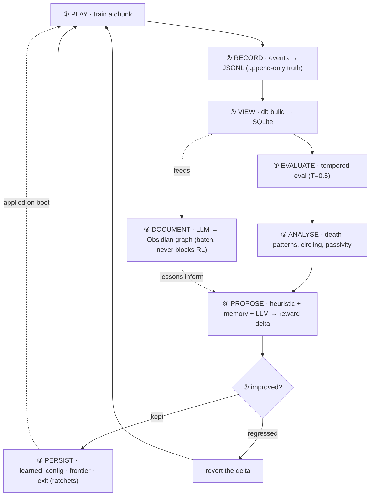

<div align="center">

# 🔥 HeLLMind

**He·LLM·ind** — *Hell* (Doom) + *LLM* + *Mind*

A Doom agent that **learns, remembers, and improves itself** — and writes the whole story
into an Obsidian knowledge graph. A local LLM documents and steers it, never blocking the
training loop. **100% local, no API key, no cost.**


</div>

---

## What it is, in one minute

You train a neural network to play Doom with PPO (reinforcement learning). That part is
normal. What makes HeLLMind different is everything **around** it:

- The agent **senses** much more than raw pixels (its own health, a map of where it's been,
  3D depth, enemy detection…).
- It **remembers across runs** (deaths, frontiers, what worked) and **feeds that back** into
  its own training.
- It **forms hypotheses, runs A/B experiments, and keeps what's proven** — a self-improvement
  loop, not just a training script.
- A local **LLM documents** all of it into an Obsidian graph, in batch, so it never slows the
  RL loop.
- You can even **play yourself** and the agent learns from your demonstration.

Everything is on by default — clone it, run one command, and the full agent is working.

---

## 🧠 How the agent is built (the architecture)

Think of it as a creature with **senses → a brain → memory → a coach**.

```
                        ┌─────────────────────── THE AGENT ───────────────────────┐
   ViZDoom (Doom)  ───▶ │  SENSES (observation)          BRAIN (neural net)        │ ──▶ action
                        │  • pixels (what it sees)        • CNN reads the image     │
                        │  • spatial memory (where I've   • + a small net reads     │
                        │    been)                          health/ammo             │
                        │  • depth (3D distance)          • MultiInputPolicy (PPO)  │
                        │  • automap (top-down layout)    • ~1.7M parameters        │
                        │  • health + ammo (its state)    └──────────────────────  │
                        │  • on-screen enemy detection                              │
                        └────────────────────────────┬─────────────────────────────┘
                                                     │  every episode
                                                     ▼
   ┌──────────────────────── MEMORY (persists across runs) ────────────────────────┐
   │  deaths + context · frontier cells · exit positions · lessons · learned config │
   └────────────────────────────────────┬──────────────────────────────────────────┘
                                         │  drives decisions
                                         ▼
   ┌──────────────────────── COACH (the self-improvement loop) ────────────────────┐
   │  behaviour flags → hypotheses → A/B experiments → adopt what's proven          │
   │  + reward auto-tuning + curriculum + LLM documentation (batch, never blocks)   │
   └───────────────────────────────────────────────────────────────────────────────┘
```

### 1. Senses — what the agent perceives

The agent learns from reward, not labels. By default it perceives **all** of these:

| Sense | What it gives the agent | Inspired by |
|-------|-------------------------|-------------|
| **Pixels** (84×84, stacked) | the raw view | every Doom RL agent |
| **Spatial memory** | a 2nd image channel showing where it has already been | exploration research |
| **Depth buffer** | per-pixel distance → 3D structure for navigation | UNREAL / Arnold |
| **Automap** | a top-down map of the explored layout | navigation agents |
| **Health + ammo** | normalised numbers fed into the net → it KNOWS when it's weak | **DFP / Arnold (the ViZDoom winners)** |
| **Enemy detection** | ground-truth "is an enemy on screen?" from the labels buffer | Arnold's aux signal |

### 2. Brain — the neural network

A PPO policy: a **CNN** reads the stacked image, a **small network** reads the health/ammo
vector, and they combine (`MultiInputPolicy`, ~1.7M parameters). Run `doom-cli intel` to see
the exact architecture, parameter count, and depth — proof it's a real neural network.

### 3. Senses for exploration & combat (reward shaping)

| Signal | What it does |
|--------|--------------|
| **RND** (curiosity) | rewards visiting unfamiliar places — never saturates |
| **Go-Explore** | sends the agent back to a far frontier cell, then explores from there |
| **Frontier reward** | pays only *net outward* progress (spinning in circles can't farm it) |
| **Exit proximity** | once the exit is found once, a dense gradient guides the agent back |
| **Engagement reward** | small bonus for facing enemies (anti-passivity) |
| **Bestiary reward** | deadlier monsters (the ones that actually kill it) are worth more |

### 4. Memory — what persists across runs

Stored on disk (JSONL for safe writes, SQLite as the queryable view):

- **Death patterns** (health, region, which enemy) — used to target the agent's real weakness.
- **Frontier archive** (Go-Explore) — grows every run; the agent can be sent further over time.
- **Exit memory** — the first time it reaches an exit, the position is saved forever.
- **Learned config** — any reward change *proven* to help is kept permanently.
- **Lessons / bestiary** — LLM-extracted insights and a factual monster database.

### 5. Coach — the self-improvement loop

```
train a chunk → evaluate (tempered, the honest measure) → score against the GOAL
   → tune the reward toward the weakest metric (heuristic + memory + optional LLM)
   → revert anything that regressed → adopt anything proven → repeat
```

`doom-cli auto` runs this loop. It **resumes by default** and accumulates — leave it running
and it keeps improving without losing progress.

### Learning from YOU (behavioral cloning)

You can play a few rounds yourself; the agent clones your play as a starting point, then RL
refines it. This is the strongest lever for the hardest problem (reaching the exit) — it
turns "explore a maze blindly" into "fine-tune something that already roughly works".

```bash
python scripts/record_demo.py --map MAP01 --episodes 3 --strafe --minutes 10  # you play
doom-cli bc --epochs 10                                                         # it learns from you
doom-cli auto --map MAP01 --iterations 8 --steps 100000                         # RL refines
```

> Note: recording needs a game window, so play on your own machine (not headless Colab).

---

## 🧠 The knowledge loop (how it learns about its own learning)

HeLLMind is **two interlocking loops**. A **fast loop** tunes the agent (play → eval →
propose → keep/revert). A **slow loop** accumulates knowledge (events → lessons → an Obsidian
graph). The bridge is the *propose* step: it consults the accumulated memory, so the more the
slow loop turns, the smarter the fast loop's decisions get.



**Three rules keep it honest:**
1. **JSONL writes, SQLite only reads** — documentation never corrupts the source of truth.
2. **The LLM is decoupled & batch** — if the local model is down, RL keeps training.
3. **Knowledge is adopted only if PROVEN** — a lesson or knob enters `learned_config` only if
   it survives tempered eval. This gate is what stops the agent from "learning" noise (you can
   watch rejected iterations in `doom-cli timeline`).

Knowledge lives in four layers: **JSONL** (raw truth) → **SQLite** (queryable view) →
**Obsidian** (human-readable graph) → **learned_config + stores** (machine-applied). Full
diagram in [`vault/00-index/Knowledge Loop.md`](vault/00-index/Knowledge%20Loop.md).

---

## 🚀 Quick start (local)

```bash
git clone https://github.com/MatheuslFavaretto/HeLLMind.git && cd HeLLMind
python3.12 -m venv .venv && source .venv/bin/activate
pip install -r requirements.txt

doom-cli auto --map MAP01 --iterations 8 --steps 100000   # train + self-improve
doom-cli intel                                            # see the neural network + stats
doom-cli eval --temperature 0.5                           # measure how it actually plays
```

Everything is enabled by default in `.env`. The brain lives in the vault and is **reused**
automatically — run `auto` again and it continues. Use `--clear` to start over.

## ☁️ Run on Google Colab (free GPU)

The honest gap vs the ViZDoom champions is **compute** — they trained on GPU clusters for
days. A free Colab GPU + Google Drive + the resume loop lets you accumulate far more training
without tying up your machine. Full step-by-step in **[`COLAB.md`](COLAB.md)**.

---

## 🎮 Commands

```bash
# Run
doom-cli auto      # the main loop: train → eval → self-tune → repeat (resumes by default)
doom-cli train     # one-shot training (no self-tuning)
doom-cli bc        # behavioral cloning from your recorded demos
doom-cli eureka    # LLM evolves the reward design across generations
doom-cli watch     # watch the agent play in a window

# Measure
doom-cli eval --temperature 0.5   # honest metrics (kills, exploration, exit-rate)
doom-cli intel                    # neural-net proof + training + memory + disk
doom-cli timeline                 # evolution per auto iteration (explored/exit/kills/score)
doom-cli audit                    # is it REALLY learning? (entropy, KL, value loss)
doom-cli progress                 # learning curve across checkpoints
doom-cli status                   # brain + memory + config at a glance

# Cognition / memory
doom-cli diagnose     # eval + behavior flags + next-step suggestion
doom-cli behavior     # detect circling / passive / low-exploration / shoot-spam
doom-cli hypothesize  # turn behaviour into falsifiable hypotheses
doom-cli experiment   # run a multi-seed A/B to validate a hypothesis
doom-cli learned      # reward knobs the agent has PROVEN help
doom-cli db query --runs   # per-iteration metrics straight from the SQLite view
doom-cli recall       # query episodic memory (by keyword / enemy / region)
doom-cli bestiary     # factual monster database
doom-cli curriculum   # map difficulty + forgetting alerts
```

Toggle anything in `.env`. The heavy perception channels (`DEPTH_PERCEPTION`, `AUTOMAP`) are
on by default for the richest agent — set them to `0` for ~3–4× faster training if you're
compute-limited.

---

## 📊 Where it stands (honest)

This is a research/learning project, and it says so plainly. The measured reality:

- ✅ **Passivity solved** — the agent went from freezing at spawn (90% timeouts) to actively
  fighting and exploring.
- ✅ **The machinery works** — every feature above is wired, tested (320 tests), and the
  self-improvement loop demonstrably tunes the agent and accumulates memory across runs.
- ⚠️ **Exploration ~11%** and climbing as it trains longer.
- ❌ **Exit-rate still 0%** — the agent hasn't completed a map yet. The remaining gap is
  **compute**, not features: architecturally this has the champions' toolkit; it needs the
  training budget (hence Colab).

> The project's own rule: *don't pile cognitive machinery on a weak agent — every feature
> must be shown to help on honest (deterministic/tempered) eval, not just produce a note.*

---

## 🗂️ Code layout

```
doom/            ViZDoom env (campaign.py), entities, RND, env adapter
rl/              PPO: train · eval · autonomous (the loop) · bc · eureka · audit · introspect
                 algo (policy/brain naming) · curriculum · experiment · memory_policy
writer/          LLM client · notes · learned_config · memory/coverage/exit/frontier stores
instrumentation/ metrics · tracker · game variables
scripts/         record_demo (you play) · make_gif · probe_map
doom_cli.py      one unified CLI · config.py all settings (.env → dataclass)
```

## 🧪 Tests

```bash
doom-cli tests        # 320 tests — no ViZDoom / Ollama needed (synthetic data)
```

## 📜 License

MIT
